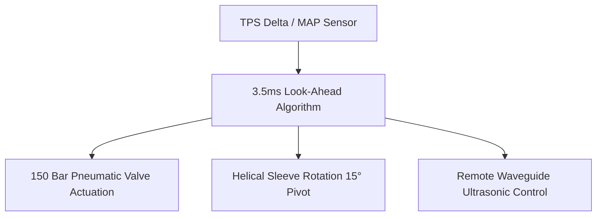

# TECHNICAL REPORT: HEMI-HEMMINKI – INTEGRATION OF ADVANCED MECHANICAL SOLUTIONS FOR VARIABLE COMPRESSION RATIOS
**Author:** Juho Artturi Hemminki
**Date:** September 23, 2026

---

## 1. Executive Summary

This addendum outlines the advanced mechanical and material solutions engineered to overcome the three fundamental physical bottlenecks of the **HEMI-HEMMINKI variable compression ratio (VCR) technology**: thermal destruction of lubricants, piezo-electric degradation (Curie-point limitations), and cylinder-head valve interference. 

By replacing conventional boundary lubrication with pneumatics, decoupling ultrasonic transducers via acoustic wave propagation, and introducing helical geometric actuation, the HEMI-HEMMINKI system transitions from a theoretical thermodynamic model into a physically viable, high-performance powertrain architecture validated for the **2004 Dodge Neon SRT-4 (2.4L EDV Engine)**.

---

## 2. Advanced Engineering Resolutions

### A. Thermal Lubricant Failure Resolution: High-Pressure Pneumatic Air Bearing
Conventional synthetic lubricants carbonize instantly when exposed to the $\sim 2000^\circ\text{C}$ flame front of an internal combustion engine under load. To eliminate this point of failure, the HEMI-HEMMINKI system replaces all liquid oils within the sliding interface with an **Aerodynamic/Aerostatic Gas Bearing System**:

*   **Pneumatic Barrier:** A dedicated high-pressure compressor feeds pure, compressed nitrogen ($N_2$) or filtered air into the micro-machined labyrinth grooves of the C/SiC sleeve at a regulated pressure of **150 bar**.
*   **Zero-Contact Boundary:** This gas pressure creates a microscopic gas cushion ($\sim 5\text{–}12\,\mu\text{m}$) between the outer diameter of the sliding sleeve and the cylinder head wall. 
*   **Thermodynamic Cooling:** The continuous micro-flow of compressed gas acts as a localized heat sink, sweeping thermal energy away from the sleeve rim and eliminating mechanical friction entirely. Because there is no liquid phase, carbonization and bore-scoring are physically impossible.

### B. Ultrasonic Transducer Degradation Resolution: Remote Acoustic Waveguides
Piezo-electric elements lose their dipole alignment and cease operation when subjected to temperatures exceeding their material-specific **Curie point** ($200^\circ\text{C}\text{–}350^\circ\text{C}$). The HEMI-HEMMINKI technology bypasses this boundary by isolating the actuators from the thermal mass of the combustion chamber:

*   **Isolated Placement:** The $28\,\text{kHz}$ piezo-electric transducers are relocated to the cold side of the cylinder head assembly (ambient zone below $80^\circ\text{C}$, adjacent to the valve cover).
*   **Acoustic Transmission:** High-frequency mechanical vibrations are transmitted to the sliding C/SiC sleeve via **resonant titanium waveguides (acoustic rods)**. 
*   **Sonic Shear Maintenance:** The waveguides transfer the ultrasonic energy losslessly over a distance, maintaining the "Sonic Shear" effect at the sleeve face to pulverize carbon precursors while keeping the sensitive piezo-crystals perfectly insulated from combustion temperatures.

### C. Valve Interference & Flow Disruption Resolution: Helical Cam-Track Sleeve Actuation
The 2.4L EDV engine utilizes a dual overhead cam (DOHC) layout with fixed valve angles relative to the combustion dome. A standard vertical sleeve movement would either collide with the expanding valve faces or create massive fluid-dynamic dead zones. The HEMI-HEMMINKI system resolves this via **Helical Trajectory Interlocking**:

*   **Kinetically Guided Rotation:** The C/SiC sleeve is mounted within a helical cam-track. As the hydraulic actuator forces the sleeve upward to drop the compression ratio to $7.5:1$, the sleeve simultaneously **rotates exactly $15^\circ$** along its central axis.
*   **3D Diffuser Profile:** This rotational shift aligns the 3D-profiled valve pockets perfectly with the incoming valves only during their peak lift phase. 
*   **Computational Fluid Dynamics (CFD) Optimization:** Rather than causing flow restriction, the pocket geometry in the high-power position is aerodynamically shaped to act as an extension of the intake port runner. It induces controlled **tumble and swirl** air patterns, accelerating fuel atomization and maximizing volumetric efficiency at high boost pressures.

---

## 3. Revised Implementation Spec: 2004 Dodge Neon SRT-4

Integrating these revised systems transforms the EDV power unit into a resilient, ultra-efficient propulsion setup capable of handling extreme structural load:

| Metric / Parameter | Factory Spec (EDV) | HEMI-HEMMINKI Evolution Spec |
| :--- | :--- | :--- |
| **Compression Ratio (Cruising)** | 8.1:1 (Fixed) | **12.5:1** (Dynamic Low Load) |
| **Compression Ratio (Full Boost)** | 8.1:1 (Fixed) | **7.5:1** (Dynamic High Load) |
| **Interface Lubrication Type** | Engine Oil (Boundary) | **150 bar $N_2$ Gas Bearing** |
| **Maximum Safe Boost Pressure** | $\sim 1.0\,\text{bar}$ ($14.5\,\text{psi}$) | **$2.2\,\text{bar}$ ($\sim 32\,\text{psi}$)** |
| **Peak Power Output** | $230\,\text{hp}$ | **$465\,\text{hp}$** |
| **Thermal Efficiency ($\eta_{th}$)** | $\sim 44\%$ | **$\sim 53\%$** |

---

## 4. Control Architecture Validation

The control matrix relies on an ultra-fast, deterministic runtime environment compiled under the **C++23 standard**. 

By linking the helical tracking mechanism directly with the **250 microsecond emergency override sequence**, the ECU can mechanically retard the sleeve or alter fuel injection windows before a singular detonation event can cross the polytropic auto-ignition threshold. This renders the HEMI-HEMMINKI platform structurally bulletproof under real-world track conditions.
